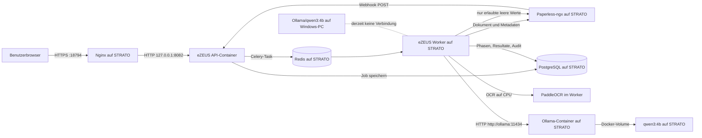

# eZEUS-AI-2

> **Wichtige Klarstellung zum Betriebsort von Qwen3:4b (Stand 03.08.2026)**
>
> Die produktive eZEUS-AI-2-Instanz verwendet **nicht** das Ollama auf dem
> Windows-PC des Betreibers. Sie verwendet einen eigenen Ollama-Container auf
> dem STRATO-Server `192.0.2.10`. `qwen3:4b` ist auf dem Windows-PC zwar in
> Ollama installiert, war bei der Prüfung am 03.08.2026 aber nicht geladen
> (`ollama ps` ohne Eintrag). Es existiert derzeit kein von eZEUS-AI-2 genutzter
> Netzwerkpfad vom Server zum PC.
>
> In älteren Texten bedeutete „lokal“ teilweise nur „nicht über einen
> Cloud-KI-Anbieter“, „im privaten Docker-Netz“ oder „Self-hosted“. Das ist für
> die Anforderung „das Modell läuft auf meinem PC“ falsch bzw. irreführend.
> Diese README verwendet deshalb die eindeutigen Begriffe **Windows-PC**,
> **STRATO-Server** und **Ollama-Container**.

## Verifizierter Ist-Zustand

Diese Tabelle beschreibt den am 03.08.2026 direkt geprüften Zustand. Sie ist
keine Beschreibung der ursprünglich gewünschten PC-Architektur.

| Bestandteil | Tatsächlicher Ort | Zustand bei der Prüfung | Nachweis |
| --- | --- | --- | --- |
| Browser | Windows-PC oder anderer Client | Zugriff über HTTPS | `https://192.0.2.10:18794/` |
| Nginx | STRATO-Server | aktiv | Reverse Proxy auf `127.0.0.1:8082` |
| eZEUS API | STRATO-Server, Docker | healthy | `ezeus-ai-2-api-1` |
| eZEUS Worker und PaddleOCR | STRATO-Server, Docker | healthy | `ezeus-ai-2-worker-1` |
| PostgreSQL | STRATO-Server, Docker | healthy | `ezeus-ai-2-postgres-1` |
| Redis / Celery-Broker | STRATO-Server, Docker | healthy | `ezeus-ai-2-redis-1` |
| Produktiv verwendetes Ollama | **STRATO-Server, Docker** | healthy | `ezeus-ai-2-ollama-1` |
| Produktiv verwendetes Modell | **STRATO-Server, Docker-Volume** | vorhanden | `qwen3:4b`, ID `359d7dd4bcda…` |
| Ollama auf dem Windows-PC | Windows-PC | API erreichbar, Modell installiert, bei Prüfung nicht geladen | `ollama list` enthält das Modell; `ollama ps` war leer |
| Verbindung eZEUS → PC-Ollama | nicht vorhanden | **nicht implementiert** | eZEUS nutzt den Docker-DNS-Namen `ollama` |
| Cloud-KI | kein implementierter Produktivpfad | deaktiviert | `CLOUD_AI_GLOBALLY_ALLOWED=false` |

Die produktive API und der Worker erhalten diese entscheidende Konfiguration:

```text
OLLAMA_ENABLED=true
OLLAMA_BASE_URL=http://ollama:11434
OLLAMA_MODEL=qwen3:4b
LOCAL_ONLY=true
CLOUD_AI_GLOBALLY_ALLOWED=false
```

`http://ollama:11434` ist **keine Adresse des Windows-PCs**. `ollama` ist der
Service- und DNS-Name des Compose-Dienstes im privaten Docker-Netz des
STRATO-Servers. `LOCAL_ONLY=true` ist nur ein Anwendungsschalter gegen
Cloud-Verarbeitung; die Variable beweist nicht, dass auf dem Benutzer-PC
gerechnet wird.

### Ergebnis der technischen Prüfung vom 03.08.2026

- Alle fünf produktiven Container liefen und waren healthy.
- `/ready` meldete Datenbank, Redis, Paperless, OCR und Ollama als bereit.
- `qwen3:4b` war im Server-Container vorhanden.
- Ein echter `/api/chat`-Aufruf aus dem eZEUS-API-Container an
  `http://ollama:11434` wurde vom Servermodell beantwortet.
- Auf dem Windows-PC waren Ollama 0.32.5 und `qwen3:4b` installiert.
- Auf dem Windows-PC lauschte Ollama ausschließlich auf `127.0.0.1:11434`.
- `127.0.0.1` ist nur vom Windows-PC selbst erreichbar. Der STRATO-Server kann
  diese Adresse nicht als PC-Adresse benutzen.
- `ollama ps` zeigte auf dem Windows-PC kein geladenes Modell.
- Der produktive Stack veröffentlicht den Server-Ollama-Port 11434 nicht auf
  dem Server-Host. API und Worker erreichen ihn nur intern über Docker.

## Soll/Ist-Abweichung

Die vorgegebene Zielarchitektur lautete sinngemäß: **Qwen3:4b soll lokal auf
dem Windows-PC laufen und eZEUS-AI-2 soll dieses Modell verwenden.**

Das ist derzeit nicht umgesetzt. Der aktuelle Stand erfüllt nur die andere
Anforderung „self-hosted, ohne Cloud-KI“, weil Modell und Anwendung gemeinsam
auf dem STRATO-Server laufen.

| Anforderung | Ist erfüllt? | Begründung |
| --- | --- | --- |
| Keine Dokumentdaten an einen Cloud-KI-Anbieter senden | ja, nach aktueller Konfiguration | Ollama läuft self-hosted; Cloud-KI ist deaktiviert |
| Qwen3:4b ist auf dem PC installiert | ja | Modell ist in `ollama list` vorhanden |
| Qwen3:4b rechnet auf dem PC | im geprüften Zustand nein | `ollama ps` war leer |
| Produktives eZEUS verwendet das PC-Modell | **nein** | Basis-URL ist der Docker-Service `ollama` auf dem Server |
| Verarbeitung funktioniert, wenn der PC ausgeschaltet ist | derzeit ja | die KI läuft auf dem Server |
| Verarbeitung stoppt oder fällt zurück, wenn der PC nicht erreichbar ist | nein | der PC ist nicht Teil des Datenpfads |

Eine Umstellung auf PC-Inferenz ist ein eigener Architektur- und
Sicherheitsumbau. Dafür wären mindestens ein abgesicherter Netzwerkkanal
(beispielsweise WireGuard oder Tailscale), eine nicht nur an
`127.0.0.1` gebundene und authentifizierte Modell-API, Firewallregeln,
TLS/Authentisierung, definiertes Ausfallverhalten und ein nachweisbarer
End-to-End-Test nötig. Das darf nicht durch bloßes Ändern eines Modellnamens
oder einer Dashboard-Anzeige als erledigt gelten.

## Systemarchitektur



### Öffentlicher und interner Netzwerkpfad

1. Der Browser ruft `https://192.0.2.10:18794/` auf.
2. Nginx terminiert TLS und schützt die Verwaltungsoberfläche mit Basic Auth.
3. Nginx leitet intern an `127.0.0.1:8082` weiter.
4. Dieser Loopback-Port führt zum API-Container-Port 8080.
5. API, Worker, PostgreSQL, Redis und Ollama kommunizieren zusätzlich über
   private Docker-Netze.
6. Der Name `ollama` wird dort von Docker auf den Server-Ollama-Container
   aufgelöst.
7. Der Windows-PC und dessen `127.0.0.1:11434` sind nicht Teil dieses Pfads.

### Produktionsdateien und persistente Daten

| Zweck | Ort auf dem STRATO-Server |
| --- | --- |
| Git-Arbeitskopie | `/home/jarvis/jarvis-brain/projects/ezeus-ai-2` |
| Produktive Compose-Datei | `/home/jarvis/jarvis-brain/projects/ezeus-ai-2/docker-compose.production.yml` |
| Produktive Secrets und Umgebungswerte | `/home/jarvis/.config/ezeus-ai-2/env` |
| Nginx-Site | `/etc/nginx/sites-available/ezeus-ai-2` |
| Nginx-Aktivierung | `/etc/nginx/sites-enabled/ezeus-ai-2` |
| eZEUS-Datenbankdaten | Docker-Volume `ezeus-ai-2_postgres_data` |
| Redis-AOF und Queue-Daten | Docker-Volume `ezeus-ai-2_redis_data` |
| PaddleOCR-Modelle | Docker-Volume `ezeus-ai-2_ocr_models` |
| Qwen3/Ollama-Modelldateien auf dem Server | Docker-Volume `ezeus-ai-2_ollama_models` |
| Privates eZEUS-Netz | Docker-Netz `ezeus-ai-2_backend` |

Die Secret-Datei hat auf dem Server Modus 600. Ihre Werte gehören weder in
diese README noch in Git, Screenshots, Tickets oder Präsentationen. Die
Compose-Datei referenziert die Datei; Docker übergibt die Werte beim
Containerstart als Umgebungsvariablen an API und Worker.

Die lokale Repository-Datei `docker-compose.yml` ist primär für Entwicklung
und Tests gedacht. Sie enthält einen Paperless-Mock und keinen Ollama-Dienst.
Sie beschreibt daher **nicht** vollständig den produktiven STRATO-Stack.

## Vollständiger Verarbeitungsablauf

### 1. Dokumenteingang in Paperless

Paperless importiert ein Dokument, führt seine eigene Verarbeitung aus und
ordnet – abhängig von der Paperless-Konfiguration – Metadaten wie Dokumenttyp,
Korrespondent oder Tags zu. eZEUS-AI-2 ersetzt diesen Importprozess nicht.

### 2. Webhook an eZEUS-AI-2

Ein Paperless-Workflow sendet nach dem vorgesehenen Ereignis einen
authentifizierten POST an eZEUS. eZEUS normalisiert das Ereignis und legt anhand
der Event-ID idempotent einen persistenten Job an. Ein wiederholtes identisches
Ereignis soll keinen zweiten unabhängigen Job erzeugen.

### 3. Persistenz und Queue

Die API speichert Job und Dokumentreferenz in PostgreSQL. Danach wird eine
Celery-Aufgabe über Redis in eine der Queues `high`, `normal` oder `low`
gestellt. Die Dokumentverarbeitung erfolgt asynchron im Worker und nicht im
Webhook-HTTP-Request.

### 4. Dokument und Metadaten laden

Der Worker lädt den aktuellen Paperless-Datensatz: Dokument-ID, Dateiname,
MIME-Typ, Dokumenttyp, vorhandenen OCR-Inhalt und Custom Fields. Die passende
Paperless-Instanz wird aus Connector und Instanzkonfiguration bestimmt.

### 5. Textquelle bestimmen

- Ist in Paperless bereits Text vorhanden, verwendet eZEUS diesen Text und
  überspringt Download, PaddleOCR und das Zurückschreiben von OCR-Inhalt.
- Ist kein Text vorhanden, lädt der Worker das Original in ein temporäres
  Verzeichnis und führt PaddleOCR aus.
- PaddleOCR läuft im Worker-Container auf dem STRATO-Server, aktuell auf CPU.
- Der temporäre Originaldownload wird nach dem Job entfernt.

### 6. Optionale Qwen-OCR-Nachbearbeitung

Nur wenn Ollama und `OCR_QWEN_CLEANUP_ENABLED` aktiviert sind, kann der rohe
PaddleOCR-Text an Qwen übergeben werden. Eine Nachbearbeitung wird nur
akzeptiert, wenn die Schutzprüfungen des Codes sie erlauben; andernfalls bleibt
der unveränderte PaddleOCR-Rohtext maßgeblich. Rohtext, bereinigter Text,
Akzeptanz und Ablehnungsgrund werden als OCR-Artefakt protokolliert.

### 7. Feldkonfiguration auswählen

Bei einer konfigurierten Paperless-Instanz wird die mandantenbezogene
Feldkonfiguration verwendet. Andernfalls versucht eZEUS zuerst eine aus
Paperless-Custom-Fields abgeleitete Konfiguration und danach ein versioniertes
Template für den bereits bekannten Paperless-Dokumenttyp.

Wichtig: Qwen klassifiziert aktuell nicht automatisch den Dokumenttyp. Der
Dokumenttyp kommt aus Paperless bzw. aus der vorhandenen Konfiguration.

### 8. Felder extrahieren

Jedes aktive Feld besitzt eine geordnete Liste von Providern:

- `regex`: deterministische Extraktion über reguläre Ausdrücke;
- `keyword`: deterministische Zuordnung über Schlüsselwörter;
- `ollama`: strukturierte Extraktion über Qwen3:4b.

Der Ollama-Provider sendet Text per `/api/chat` an das konfigurierte Modell. Er
fordert JSON mit `found`, `value` und `confidence`, setzt Temperatur 0 und
begrenzt die Eingabelänge. Ein Modellwert wird verworfen, wenn er nach
Normalisierung nicht im Quelldokument vorkommt. Diese Grounding-Prüfung
reduziert Halluzinationen, beweist aber keine fachliche Richtigkeit.

### 9. Kandidaten validieren und auswählen

Alle Kandidaten werden mit Feldvalidatoren geprüft und normalisiert. Werte
unterhalb der Mindestkonfidenz werden nicht übernommen. Abhängig von der
Konfiguration wird der erste, höchste oder eindeutig übereinstimmende Wert
gewählt. Widersprüchliche valide Kandidaten werden nicht stillschweigend als
eindeutiges Ergebnis behandelt.

### 10. Metadaten vor dem Schreiben neu laden

Der Worker lädt das Paperless-Dokument erneut. Das reduziert das Risiko,
zwischenzeitliche Benutzeränderungen mit einem veralteten Stand zu
überschreiben.

### 11. Nach Paperless schreiben

- Custom Fields werden nur geschrieben, wenn sie leer sind.
- Bereits vorhandene Werte bleiben erhalten.
- Eine Rechnungsnummer kann nach den Connector-Schutzregeln als Titel gesetzt
  werden.
- Ein Korrespondent wird nur gesetzt, wenn noch keiner vorhanden ist und die
  Zuordnung ausreichend eindeutig ist.
- Jede erfolgreiche Schreiboperation erzeugt einen Audit-Eintrag.

### 12. Abschluss und Fehlerstatus

Jede Phase wird mit Start, Ende, Status und Metadaten in PostgreSQL geführt.
Der Job endet als `COMPLETED`, `COMPLETED_WITH_WARNINGS` oder `FAILED`.
Fehler werden mit Typ und begrenzter Fehlermeldung gespeichert; Celery kann
abhängig von Fehlerart und Retry-Konfiguration Wiederholungen ausführen.

## Was „bereit“ und „funktioniert“ bedeuten darf

`/health` beweist nur, dass der API-Prozess antwortet. `/ready` prüft mehrere
Abhängigkeiten, beweist aber noch keine fachlich korrekte
Dokumentverarbeitung.

Eine Aussage „PC-Inferenz funktioniert produktiv“ ist künftig nur zulässig,
wenn alle folgenden Punkte in derselben Prüfung nachgewiesen wurden:

1. eZEUS zeigt auf eine eindeutig dem PC zuordenbare, geschützte Adresse –
   nicht auf den Docker-Namen `ollama`.
2. Der Server erreicht diese Adresse über den vorgesehenen sicheren Tunnel.
3. Direkt vor dem Test ist `qwen3:4b` auf dem PC nicht geladen.
4. Ein markiertes Testdokument wird über den echten Paperless-Webhook
   verarbeitet.
5. Während dieses Jobs zeigt `ollama ps` auf dem PC `qwen3:4b` als geladen.
6. Server-Container und Server-Logs zeigen keinen serverlokalen Modellaufruf.
7. Das erwartete Feld wird korrekt geschrieben und im Audit protokolliert.
8. Ein Negativtest mit gestopptem PC-Ollama erzeugt das geplante Fehler- oder
   Fallbackverhalten.
9. Testdokumente und Testwerte werden kontrolliert entfernt.
10. Zeitpunkt, Commit, Konfiguration ohne Secrets und Ergebnis werden
    festgehalten.

Unit-Tests mit Mock-Antworten, ein Modellname im Dashboard, ein vorhandener
Modelldownload und ein grüner Containerstatus reichen **nicht** als Nachweis,
dass auf dem Windows-PC gerechnet wird.

Der ergänzende historische Projektstand steht in
[docs/CURRENT_STATE.md](docs/CURRENT_STATE.md). Bei Widersprüchen hat der oben
datierte, direkt verifizierte Ist-Zustand Vorrang; historische Aussagen müssen
vor einer Präsentation erneut geprüft werden.

## Projektbeschreibung

eZEUS-AI-2 ist eine Dokumentenverarbeitungsplattform für Paperless-ngx. Die
Anwendung nimmt Paperless-Webhooks entgegen, legt persistente
Verarbeitungsaufträge an und verarbeitet Dokumente über OCR, konfigurierbare
Extraktionsprovider und Validatoren. Ergebnisse werden nur in leere
Paperless-Felder geschrieben.

Der aktuelle Stand ist eine testbare minimale Verarbeitungspipeline und keine
freigegebene Produktionsversion.

## Ziel und Zweck

Das Projekt automatisiert die self-hosted Nachbearbeitung importierter
Paperless-Dokumente. PostgreSQL speichert Aufträge, Verarbeitungsphasen,
Templates, Extraktionsergebnisse und Auditdaten. Redis und Celery verteilen
Aufträge an Worker. Dokumentdaten können mit PaddleOCR, regulären Ausdrücken,
Schlüsselwörtern und optional einem erreichbaren Ollama-Modell verarbeitet
werden. Der physische Modellstandort wird ausschließlich durch
`OLLAMA_BASE_URL` bestimmt.

## Hauptfunktionen

- Annahme authentifizierter Paperless-Webhooks
- Idempotente Auftragserstellung anhand einer Event-ID
- Priorisierte Celery-Warteschlangen
- OCR über einen PaddleOCR-Adapter
- Extraktion über Regex-, Keyword- und Ollama-Provider
- Validierung und Normalisierung extrahierter Werte
- Schreibschutz für bereits gefüllte Paperless-Inhalte und Custom Fields
- Versionierte Templates pro Paperless-Dokumenttyp
- Auditprotokoll für Schreiboperationen
- Betriebsdashboard und bereinigte Verarbeitungsprotokolle
- Health- und Readiness-Endpunkte

## Voraussetzungen

Für den Containerbetrieb:

- Docker Engine
- Docker Compose
- ausreichend Arbeitsspeicher und Speicherplatz für PaddleOCR
- bei Ollama-Nutzung eine vom Worker erreichbare Ollama-Instanz mit dem
  konfigurierten Modell

Für die lokale Entwicklung:

- Python 3.12 oder eine kompatible neuere Version
- eine lokale oder erreichbare Redis-Instanz für Celery
- für den vollständigen Betrieb PostgreSQL und Paperless-ngx oder der
  mitgelieferte Paperless-Mock

Die Paddle-Abhängigkeiten sind nicht Bestandteil der normalen Installation.
Der dafür vorgesehene Container verwendet Python 3.12.

## Verwendete Technologien

- Python
- FastAPI und Uvicorn
- Pydantic und pydantic-settings
- SQLAlchemy und Alembic
- PostgreSQL
- Celery und Redis
- HTTPX
- PaddleOCR als optionale OCR-Abhängigkeit
- Ollama als optionaler self-hosted LLM-Dienst; der konkrete Rechner ergibt
  sich aus `OLLAMA_BASE_URL`
- Pytest, Ruff und mypy für Entwicklung und Prüfung
- Docker und Docker Compose

## Installation

### Containerinstallation

Konfigurationsvorlage kopieren:

```bash
cp .env.example .env
```

Unter PowerShell:

```powershell
Copy-Item .env.example .env
```

Alle Beispielzugangsdaten in `.env` müssen vor einer nicht lokalen Nutzung
ersetzt werden.

### Lokale Entwicklungsinstallation

```bash
python -m venv .venv
```

Aktivierung unter Linux oder macOS:

```bash
source .venv/bin/activate
```

Aktivierung unter PowerShell:

```powershell
.\.venv\Scripts\Activate.ps1
```

Projekt und Entwicklungsabhängigkeiten installieren:

```bash
python -m pip install -e ".[dev]"
```

Für lokale OCR-Entwicklung:

```bash
python -m pip install -e ".[dev,ocr-paddle]"
```

## Konfiguration

Die Anwendung liest ihre Konfiguration aus Umgebungsvariablen und optional aus
einer lokalen `.env`-Datei. Die vollständige Vorlage steht in
[.env.example](.env.example). Weitere Hinweise enthält
[docs/configuration.md](docs/configuration.md).

Die Werte in `.env.example` sind ausschließlich für die lokale Einrichtung
bestimmt. Bei `APP_ENV=production` lehnt die Anwendung leere, mit `example-`
beginnende und als `change-me` markierte Anwendungs-Secrets ab.

Ollama ist im mitgelieferten Compose-Stack nicht als Dienst definiert.
`OLLAMA_BASE_URL` muss daher auf eine separat betriebene und aus dem
Anwendungsnetz erreichbare Instanz zeigen.

Davon zu unterscheiden ist die produktive Server-Compose-Datei
`docker-compose.production.yml`, die auf dem STRATO-Server liegt und dort einen
eigenen Ollama-Dienst definiert. Diese produktive Datei ist bewusst nicht mit
der Entwicklungsdatei `docker-compose.yml` gleichzusetzen.

## Umgebungsvariablen

- `APP_ENV`: Laufzeitumgebung, beispielsweise `development`, `test` oder
  `production`
- `APP_HOST`: Bind-Adresse des API-Containers
- `APP_PORT`: Port des API-Containers und veröffentlichter Host-Port
- `APP_LOG_LEVEL`: Log-Level für Uvicorn und Celery
- `DATABASE_URL`: SQLAlchemy-Verbindungsadresse
- `POSTGRES_PASSWORD`: Passwort des PostgreSQL-Compose-Dienstes
- `REDIS_URL`: Celery-Broker und Result-Backend
- `PAPERLESS_BASE_URL`: Basisadresse der Paperless-API
- `PAPERLESS_API_TOKEN`: Paperless-API-Token
- `PAPERLESS_WEBHOOK_SECRET`: gemeinsames Secret für Paperless-Webhooks
- `ADMIN_API_SECRET`: einmaliges Bootstrap-Secret zum Anlegen des ersten
  individuellen Administratorkontos
- `CREDENTIAL_ENCRYPTION_KEY`: Fernet-Schlüssel zur Verschlüsselung gespeicherter
  Paperless-Zugangsdaten
- `PUBLIC_WEBHOOK_BASE_URL`: öffentliche eZEUS-Adresse, die auf der
  Instanzverwaltungsseite für Webhook-URLs verwendet wird
- `PAPERLESS_VERIFY_TLS`: TLS-Zertifikatsprüfung für Paperless
- `LOCAL_ONLY`: verbietet bzw. kennzeichnet Cloud-KI-Nutzung; sagt **nichts**
  darüber aus, ob das Modell auf dem Windows-PC oder auf dem STRATO-Server läuft
- `CLOUD_AI_GLOBALLY_ALLOWED`: globale Freigabe für Cloud-AI; derzeit ist kein
  Cloud-Provider implementiert
- `OLLAMA_ENABLED`: aktiviert Ollama für globale Legacy-Templates und die
  abgesicherte OCR-Nachbearbeitung; mandantenbezogene KI-Felder aktivieren
  Ollama unabhängig davon
- `OLLAMA_BASE_URL`: Basisadresse der Ollama-API
- `OLLAMA_MODEL`: Modellname auf der durch `OLLAMA_BASE_URL` bestimmten
  Ollama-Instanz
- `OLLAMA_TIMEOUT_SECONDS`: Zeitlimit eines Ollama-Aufrufs
- `OLLAMA_MAX_INPUT_CHARS`: maximale OCR-Textlänge pro Ollama-Feldextraktion
- `OLLAMA_KEEP_ALIVE`: Vorhaltezeit des Modells in Ollama
- `JOB_MAX_RETRIES`: maximale Zahl automatischer Wiederholungen
- `JOB_RETRY_DELAYS_SECONDS`: kommagetrennte Wartezeiten für Wiederholungen
- `OCR_PROVIDER`: OCR-Provider; derzeit wird `paddleocr` unterstützt
- `OCR_LANGUAGE`: OCR-Sprache
- `OCR_DEVICE`: OCR-Gerät, beispielsweise `cpu`
- `OCR_TIMEOUT_SECONDS`: Grundlage für das Celery-Zeitlimit
- `OCR_QWEN_CLEANUP_ENABLED`: aktiviert die abgesicherte Qwen-Nachbearbeitung
  ausschließlich für neu erzeugten PaddleOCR-Text
- `OCR_QWEN_CLEANUP_TIMEOUT_SECONDS`: Zeitlimit der OCR-Nachbearbeitung
- `MAX_DOCUMENT_BYTES`: maximale akzeptierte Downloadgröße

## Start der Anwendung

### Docker Compose

```bash
docker compose up --build
```

Der API-Dienst führt vor dem Start `alembic upgrade head` aus. Bei der
Standardkonfiguration ist die Anwendung unter `http://localhost:8080`
erreichbar. Der Compose-Stack startet die API, den PaddleOCR-Worker,
PostgreSQL, Redis und einen lokalen Paperless-Mock.

Status prüfen:

```bash
docker compose ps
```

Container beenden:

```bash
docker compose down
```

### Lokaler API-Start

Vor dem API-Start müssen die Datenbankmigrationen ausgeführt werden:

```bash
alembic upgrade head
uvicorn apps.api.main:app --host 127.0.0.1 --port 8080
```

Der einfache Endpunkt `/health` prüft den API-Prozess. `/ready` prüft zusätzlich
Datenbank, Redis, Paperless, die OCR-Konfiguration und bei Aktivierung Ollama.

### Lokaler Worker-Start

```bash
celery -A core.queue.celery_app.celery_app worker -Q high,normal,low --loglevel=INFO
```

## Verwendung

Das Dashboard liegt am Startpfad `/`. Die OpenAPI-Dokumentation ist unter
`/docs` erreichbar. Paperless-Instanzen werden unter `/admin/instances`
verwaltet. Zum Hinzufügen genügen Name, Paperless-URL, API-Token und
Webhook-Secret. Die Webhook-Kennung wird automatisch aus der URL erzeugt. Die
Seite wird am Reverse Proxy durch die bestehende HTTP-Basic-Authentifizierung
geschützt.

### Weboberfläche und Designsystem

Die Administrationsoberfläche orientiert sich am Markenauftritt von eZEUS-AI:
nahezu schwarze Grundflächen, abgestufte Anthrazitkarten, eZEUS-Rot als
Akzentfarbe und eine feste Seitennavigation auf großen Bildschirmen. Das
unveränderte Original-Logo liegt unter
`apps/api/static/ezeus-logo.png` und wird in Navigation und Kopfbereich
verwendet.

Das gemeinsame Grundlayout wird durch `apps/api/ui.py` erzeugt. Zentrale
Design-Tokens, Komponenten- und Responsive-Regeln befinden sich in
`apps/api/static/ezeus-ui.css`; das gemeinsame Verhalten für mobile Navigation,
Ladezustände und Meldungen liegt in `apps/api/static/ezeus-ui.js`. Die
Oberfläche verwendet folgende Breakpoints:

- Desktop ab 1180 Pixel mit breiten Mehrspalten-Layouts,
- Notebook und Tablet bis 1180 beziehungsweise 860 Pixel,
- Smartphone bis 600 Pixel mit einklappbarer Navigation sowie gestapelten
  Formularen und Karten.

Tabellen bleiben auf kleinen Bildschirmen horizontal scrollbar. Alle
Formularfelder besitzen sichtbare Beschriftungen, interaktive Elemente
Fokusmarkierungen und kritische Deaktivierungen eine Bestätigung.

Einen Fernet-Schlüssel für `CREDENTIAL_ENCRYPTION_KEY` erzeugen:

```bash
python -c "from cryptography.fernet import Fernet; print(Fernet.generate_key().decode())"
```

Für jede angelegte Instanz zeigt die Verwaltungsseite eine eigene Webhook-URL:

```text
https://<ezeus-host>/webhooks/paperless/<instanzkennung>
```

Beim Anlegen einer Instanz prüft eZEUS die API-Verbindung und erstellt in
Paperless automatisch den verwalteten Workflow
`eZEUS-AI-2 – automatische Dokumentverarbeitung`. Er reagiert auf neu
hinzugefügte und aktualisierte Dokumente, sendet die Dokument-ID als JSON und
authentifiziert sich mit einem automatisch erzeugten instanzbezogenen
Webhook-Secret. Ein erneuter
Aufruf über `Workflow einrichten` repariert den verwalteten Workflow
idempotent, ohne benutzerdefinierte Workflows zu verändern.
Für Paperless 2.20.x wird die Dokument-ID kompatibel aus der von Paperless
bereitgestellten Dokument-URL ermittelt, da diese Version den dokumentierten
Workflow-Platzhalter `doc_id` noch nicht an Webhook-Templates übergibt.

URL, API-Token und Webhook-Secret werden pro Instanz verwaltet. API-Token und
Webhook-Secret liegen verschlüsselt in der Datenbank und werden über API und
Oberfläche nicht im Klartext ausgegeben. Die Instanzkennung trennt Dokumente
und Ereignisse verschiedener Paperless-Systeme.

### Mandantenbezogene Feldkonfiguration

Jede Paperless-Instanz ist ein eigener Mandant. Die beim Anlegen aus der
Paperless-URL erzeugte Kennung (`slug`) ist dauerhaft eindeutig. Webhooks,
Feldkonfiguration und Verarbeitung verwenden dieselbe Kennung:

```text
/webhooks/paperless/<instanzkennung>
/admin/instances/<instanzkennung>/fields
/api/instances/<instanzkennung>/field-config
```

Die Verwaltungsseite `/admin/instances` enthält für jede Instanz einen Link
`Feldkonfiguration`. Das Bootstrap-Secret erlaubt nur so lange administrative
Zugriffe, bis unter `/api/admin-users/page` das erste persönliche Konto
angelegt wurde. Danach erfolgt die Anmeldung mit Benutzername und Passwort.
Die Rolle `admin` darf ändern, die Rolle `viewer` ausschließlich lesen und
Vorschauen aufrufen. Jede Änderung wird mit dem tatsächlich authentifizierten
Konto protokolliert.

Neue Instanzen erhalten automatisch die Standardfelder Korrespondent,
Rechnungsnummer, Rechnungsdatum, Rechnungsbetrag, Kundennummer und
Baustellennummer. Pro Feld können Bezeichnung, Typ, Reihenfolge, Aktivstatus,
Pflichtstatus, OCR-Auslesung, lokale KI-Auslesung, Paperless-Feld-ID und
Extraktionshinweise konfiguriert werden. Unterstützte Typen sind Text, Zahl,
Geldbetrag, Datum, Ja/Nein, Auswahlfeld und mehrzeiliger Text.

Zusätzliche Felder erhalten einen stabilen internen Schlüssel und können später
deaktiviert werden. Bestehende Extraktionsergebnisse und Paperless-Werte werden
dabei weder gelöscht noch überschrieben. Die Vorschau wird serverseitig mit
denselben Eingabeschemata validiert wie das Speichern, verändert aber keine
Daten.

Beim Laden der Feldkonfiguration werden vorhandene Custom Fields direkt aus der
zugeordneten Paperless-Instanz übernommen. Noch nicht bekannte Paperless-Felder
erscheinen zunächst als „In eZEUS aktiv“ deaktiviert. Dieser Schalter betrifft
nur Anzeige, Extraktion und Verarbeitung in eZEUS-AI-2. Das Custom Field und
seine vorhandenen Werte bleiben in Paperless unverändert verfügbar.

Die Verarbeitung löst den Mandanten ausschließlich aus dem beim Webhook
gespeicherten Connector `paperless:<instanzkennung>` auf. Eine Mandanten-ID aus
einem Request-Payload wird nicht akzeptiert. Für verwaltete Instanzen gilt:

- deaktivierte Felder werden weder extrahiert noch geschrieben,
- das Deaktivieren in eZEUS verändert oder deaktiviert kein Feld in Paperless,
- nur erforderliche, aber fehlende Felder erzeugen einen Warnstatus,
- OCR-aktivierte Standardfelder verwenden die hinterlegten deterministischen
  Regeln,
- OCR-aktivierte benutzerdefinierte Felder verwenden ihre Bezeichnung als
  Anker,
- KI-aktivierte Felder werden mit Bezeichnung, Typ und Extraktionshinweisen in
  die lokale Ollama-Anweisung aufgenommen,
- fehlende Paperless-Custom-Fields werden mit passendem Datentyp automatisch
  angelegt und dauerhaft verknüpft,
- geänderte Bezeichnungen und Auswahloptionen werden mit Paperless
  synchronisiert; inkompatible vorhandene Datentypen werden abgewiesen,
- Korrespondentenerkennung und Dokumenttitel folgen derselben Konfiguration.

`instance_field_configs` ist über `instance_id` mit `paperless_instances`
verbunden. Der eindeutige Index auf `(instance_id, field_key)` verhindert
Überschneidungen. Änderungen erzeugen einen Eintrag in `audit_entries` mit
Administrator, Zeitpunkt, Mandant, Feldschlüssel sowie altem und neuem Wert.

Der bisherige Webhook bleibt für die globale `.env`-Konfiguration
rückwärtskompatibel:

```text
http://<host>:<port>/webhooks/paperless
```

Erforderlicher Header:

```text
X-EZEUS-Webhook-Secret: <PAPERLESS_WEBHOOK_SECRET>
```

Beispiel-Payload:

```json
{
  "document_id": 128,
  "event_id": "paperless-event-128"
}
```

Ein neuer Auftrag liefert HTTP 202. Ein bereits verarbeitetes Event liefert
HTTP 200.

Bei der automatischen Befüllung des Feldes `Rechnungsnummer` wird zuerst nach
einer ausdrücklich bezeichneten Rechnungsnummer gesucht. Nur wenn diese fehlt,
kann eine ausdrücklich bezeichnete, fünfstellige BV-/Baustellennummer mit
Präfix `24`, `25` oder `26` verwendet werden. Kundennummern werden niemals als
Rechnungsnummer übernommen. Fehlen beide zulässigen Werte, bleibt das Feld leer
und der Auftrag wird mit einer Warnung protokolliert.

Templates werden über `POST /api/templates` angelegt. Der Aufruf benötigt den
Header `X-EZEUS-Admin-Secret`. Ein minimales Template:

```json
{
  "name": "Eingangsrechnung",
  "document_type_external_id": "7",
  "is_default": true,
  "config": {
    "fields": {
      "invoice_number": {
        "target_field_id": 14,
        "providers": [
          {
            "type": "regex",
            "patterns": [
              "(?i)rechnungsnummer[\\s:]+([A-Z0-9./_-]+)"
            ]
          }
        ],
        "validators": [
          {
            "type": "required_pattern",
            "pattern": "^[A-Z0-9./_-]+$"
          }
        ]
      }
    }
  }
}
```

Das vollständige Format ist in
[docs/template-format.md](docs/template-format.md) beschrieben.

## Projektstruktur

- `apps/api`: FastAPI-Anwendung, Administrationsendpunkte und Dashboard
- `apps/worker`: Celery-Aufgabe für Dokumentenaufträge
- `apps/mock_paperless`: lokaler Paperless-API-Mock für Entwicklung
- `connectors`: Connector-Schnittstelle und Paperless-Implementierung
- `core/config`: Laufzeitkonfiguration
- `core/db`: SQLAlchemy-Basis und Sitzungsverwaltung
- `core/events`: interne Ereignismodelle
- `core/jobs`: Auftragserstellung und Statusübergänge
- `core/models`: persistente SQLAlchemy-Modelle
- `core/orchestration`: Verarbeitungspipeline
- `core/queue`: Celery-Konfiguration und Queue-Adapter
- `core/templates`: Template-Schema und Auswahl
- `core/validation`: Validierungs- und Normalisierungslogik
- `plugins`: Extraktions-, LLM-, OCR- und Validierungsbausteine
- `webhooks`: Paperless-Webhook, Schema und Secret-Prüfung
- `infrastructure/migrations`: Alembic-Konfiguration und Migrationen
- `scripts`: Hilfsskript zur Erzeugung der PDF-Testdatei
- `tests`: Unit-, API- und Integrationstests
- `docs`: ergänzende Architektur-, Betriebs- und Sicherheitsdokumentation

Die API startet über `apps.api.main:app`. Celery lädt
`core.queue.celery_app:celery_app`. Der Entwicklungs-Mock startet über
`apps.mock_paperless.main:app`.

## Tests

Vollständige Tests:

```bash
APP_ENV=test python -m pytest
```

Unter PowerShell:

```powershell
$env:APP_ENV = "test"
python -m pytest
```

Statische Prüfungen:

```bash
ruff check .
ruff format --check .
mypy apps connectors core plugins webhooks
```

Compose-Konfiguration prüfen:

```bash
docker compose config --quiet
```

Weitere Informationen stehen in [docs/testing.md](docs/testing.md).

## Fehlerbehebung

- `/health` antwortet, `/ready` liefert aber HTTP 503: Die Antwort enthält den
  Status von Datenbank, Redis, Paperless, OCR und gegebenenfalls Ollama.
- Paperless meldet HTTP 401: `PAPERLESS_API_TOKEN` und
  `PAPERLESS_BASE_URL` prüfen.
- Der Webhook meldet HTTP 401: Header und `PAPERLESS_WEBHOOK_SECRET` müssen
  übereinstimmen.
- Administrative Endpunkte melden HTTP 401: mit einem aktiven persönlichen
  Konto über die Verwaltungsoberfläche oder die Header
  `X-EZEUS-Admin-User` und `X-EZEUS-Admin-Password` anmelden. Nur vor dem ersten Konto kann
  `ADMIN_API_SECRET` als `X-EZEUS-Admin-Secret` verwendet werden.
- PaddleOCR ist nicht installiert: das Extra `ocr-paddle` installieren oder
  `Dockerfile.paddle` verwenden.
- Das Ollama-Modell wird nicht als bereit erkannt: `OLLAMA_ENABLED`,
  `OLLAMA_BASE_URL` und `OLLAMA_MODEL` prüfen.
- Portänderungen: `APP_PORT` in `.env` setzen und den Compose-Stack neu
  erstellen.

## Sicherheitshinweise

- `.env` und lokale Varianten sind durch `.gitignore` ausgeschlossen.
- Reale Tokens, Passwörter und Schlüssel dürfen nicht versioniert oder in
  Images eingebettet werden.
- TLS-Prüfung für Paperless ist standardmäßig aktiv.
- Dashboard, Log-Endpunkt und OpenAPI-Dokumentation besitzen keine eigene
  Benutzerverwaltung. Ein produktiver Zugriff benötigt einen
  authentifizierenden TLS-Reverse-Proxy.
- Administrationskonten verwenden Scrypt-Passworthashes und die Rollen
  `admin` und `viewer`. Das Bootstrap-Secret verliert nach dem ersten aktiven
  Administratorkonto seine Zugriffsberechtigung.
- Der Paperless-Mock ist ausschließlich für lokale Entwicklung und Tests
  vorgesehen.
- Container-Netze, Datenbank und Redis dürfen im Produktivbetrieb nicht
  öffentlich erreichbar sein.
- Der Quellcode enthält keine produktiven Zugangsdaten. Die Werte in
  `.env.example` sind erkennbare Platzhalter.

Weitere bekannte Sicherheitslücken und ausstehende Maßnahmen stehen in
[docs/security.md](docs/security.md) und im
[CODE_REVIEW_REPORT.md](CODE_REVIEW_REPORT.md).

## Backup und Wiederherstellung

PostgreSQL enthält die dauerhaften Aufträge, Templates, Ergebnisse und
Auditdaten. Vor einem Backup sollten API und Worker keine neuen Aufträge
annehmen.

Beispiel für ein PostgreSQL-Backup:

```bash
docker compose exec -T postgres pg_dump -U ezeus -d ezeus -Fc > ezeus.dump
```

Beispiel für die Wiederherstellung:

```bash
docker compose exec -T postgres pg_restore -U ezeus -d ezeus --clean --if-exists < ezeus.dump
```

Die lokale `.env`-Datei muss getrennt und verschlüsselt gesichert werden. Das
Redis-Volume enthält Warteschlangen- und Ergebniszustand, ist aber nicht die
führende fachliche Datenquelle. Das Volume `ocr_models` kann neu aufgebaut
werden, sofern die benötigten Modelle weiterhin verfügbar sind.

Eine Wiederherstellung muss zunächst in einer getrennten Umgebung getestet
werden.

## Entwicklung und Erweiterung

- Neue Extraktionsprovider implementieren `ExtractionProvider` aus
  `plugins/base/interfaces.py`.
- Neue OCR-Provider implementieren `OCRProvider` und werden in
  `plugins/ocr/factory.py` registriert.
- Neue Template-Provider und Validatornamen müssen in
  `core/templates/schema.py` freigegeben werden.
- Datenbankänderungen benötigen eine Alembic-Migration.
- Änderungen an Connectoren müssen den Schutz bereits gefüllter
  Paperless-Felder erhalten.
- Vor jeder Übernahme müssen Tests, Ruff, Formatter und mypy erfolgreich
  ausgeführt werden.

## Bekannte Einschränkungen

- Der Compose-Stack ist eine Entwicklungsumgebung und enthält einen Mock statt
  eines produktiven Paperless-Dienstes.
- Paperless-Custom-Fields werden synchronisiert; andere Referenzdaten werden
  weiterhin bei Bedarf über die API geladen.
- Dashboard und Log-API sind innerhalb der Anwendung nicht authentifiziert.
- PaddleOCR-Modelle können beim ersten Worker-Start heruntergeladen werden.
- Das Dashboard zeigt den konfigurierten Modellnamen. Diese Anzeige beweist
  weder den physischen Modellstandort noch, dass das Modell gerade geladen ist
  oder für den letzten Job verwendet wurde.
- Die Regex-Laufzeitprüfung kann einen einzelnen bereits laufenden regulären
  Ausdruck nicht unterbrechen.
- Datenbankstatus und Celery-Nachricht werden nicht über eine gemeinsame
  Transaktion oder eine Outbox koordiniert.
- Es gibt noch keine Last-, Malware-, PDF-Bomb- oder vollständigen
  End-to-End-Sicherheitstests.

## Lizenz

Im Repository ist derzeit keine Lizenzdatei vorhanden. Ohne ausdrückliche
Lizenz werden keine Nutzungs-, Änderungs- oder Weitergaberechte eingeräumt.
